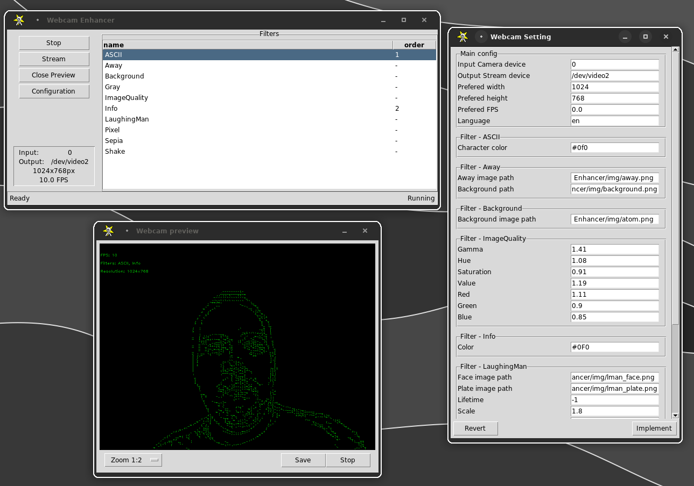

# Webcam Enhancer

Lets take control what you can do with your **stream** from your WebCam! **Tkinter** base **GUI** application with simple and extensible interface. 




Yes, it looks like *90s* Dephi Pascal RAD whatever. But why not to remember ****old times****.

Fork of [CustomCam](https://github.com/mattravenhall/CustomCam). I will probably reimplement command-line option as well. because it is faster to setup. With GUI you can mess around more easily with numbers.

## Problems

It is not [OBS](https://obsproject.com/) but on Linux it is simple to use. Should work on Windows and Mac but consult [PyVirtualCam](https://github.com/letmaik/pyvirtualcam) how to run **loopback** dummy device on your computer.

# instalation
```shell
$ git clone {this repo}
```
Will make pip package. **TODO**

# Usage

Go to cloned dir and then:
```shell
$ python -m WebCamEnhancer
```

First you need to get loopback device running, then ,for example on linux, it shoud appear as new video device like: ```/dev/video2```.
Yes, you need to load it:

```bash
$ sudo modprobe v4l2loopback devices=1 card_label="My DUMMY"
```

For example. There is option ```exclusive_caps=1``` witch helped some people. 

OK, everithing should be straight forward with one exception ,how to hadle Filter view. 

### Filter view

**Left Double-click**
  - Adds selected filter to the **bottom** of processing queue. 
  - More double-clicks icrease its order when it should be applied.

**Right-click**
 - Adds selected filter to the **top** of processing queue. 
 - Decrease order of selected filter or removes it if it is at the bottom of queue.

 **Middle-click**
 - Removes selected filter from the queue.

### Setting window

**Be aware:** there are almost no safeties what you set, so don't be suprised when it crashes, or starts to disobey.

### Data (Images)
 - Uses [AppDirs](https://github.com/ActiveState/appdirs) package to determine where to makecopy of images included in the package. So don't mess with package data. It is not a good idea.

 Main directory with settings and stuff should be:
 ```
Linux:   /home/<user>/.local/share/WebCamEnhancer
Windows: C:\\Users\\<user>\\AppData\\Local\\MPStuff\\WebCam
Mac:     /Users/<user>/Library/Application Support/WebCamEnhancer
```

# Extending

There are 3 types of **'modules'**:

## *Filter*

Class inherited from **Filter**

```python
class MyÜberFilter(Filter):
	...
```
If you need ```Configuration```:

```python
	...

	CONFIG_TEMPLATE = {
		"item": 1
	}

	...
```
Add default values dict, then in ```self.config``` you will have ```self.config["item"]```. There is other variable ```self.middleware``` where you can access **Result** of computaion by ```self.middleware["<name_if class>"].get()```. More about later.

Must implement:

```python
	...

def apply(self, frame: np.array)-> np.array:
	...
```

Can be usesfull. For loading, pre-computing and stuff...

```python
	...

def prepare(self, resolution: tuple[int, int]):
	...
```

- Look for inspiration what is already written.
- Don't mess with ```def __init__(self, ...):```. You don't need to.
- Crazier = Better
- 

## *Middleware*

Implementation is similar as ```Filter``` but this class is designed to do more **expensive calculations** which are computed only once per **Frame**

As said in **Filters** there is **Must** method ```apply(frame: np.array)-> Any``` where you can access the result of computation from multiple filters.


## *Driver*

### TODOO ...

Will be used to register new behaviours, like stop streaming when ```Segmentator``` will not detect you for, lets say 30 seconds.


## HOPE YOU ENJOY IT. CHEERS!
